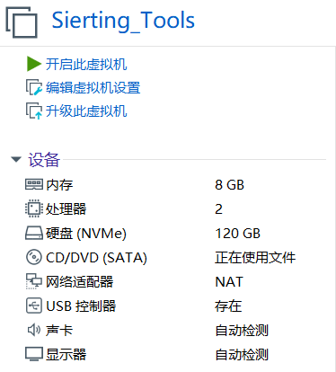
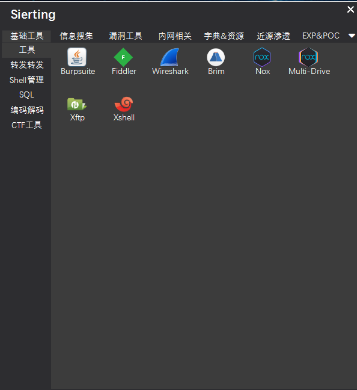
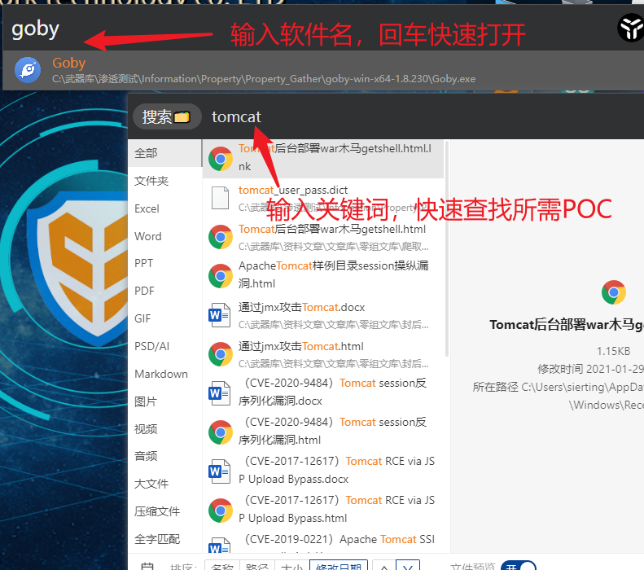
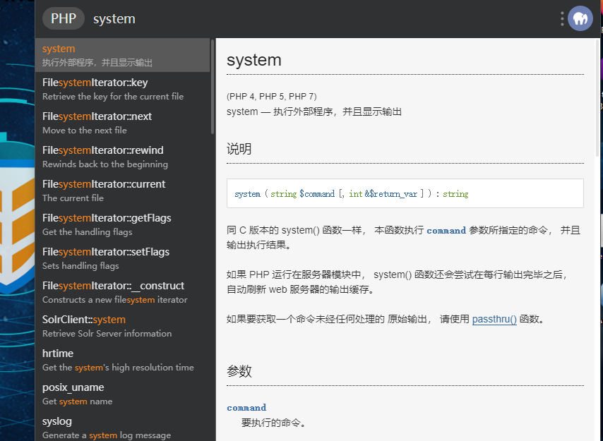
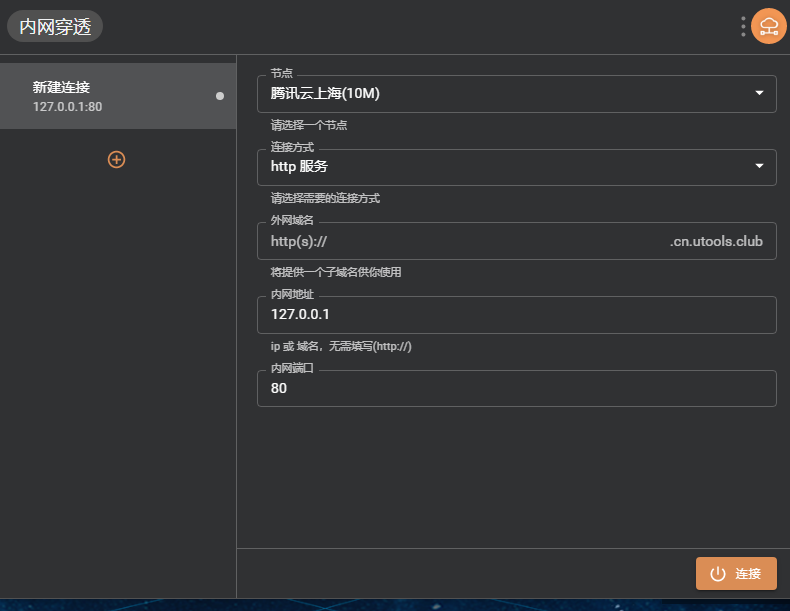
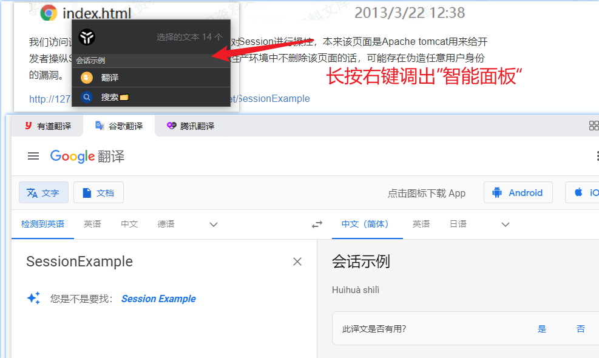
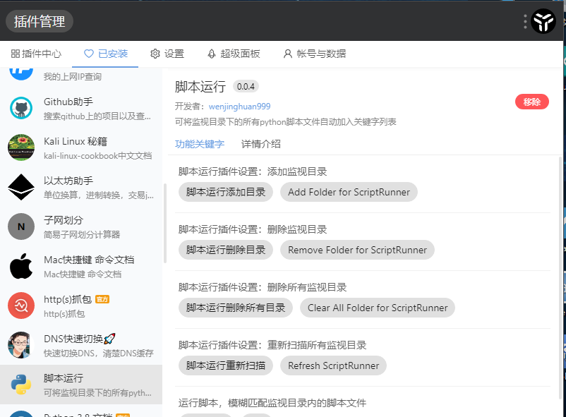
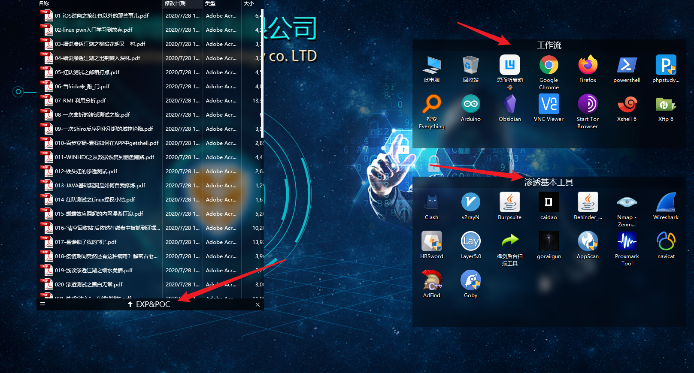
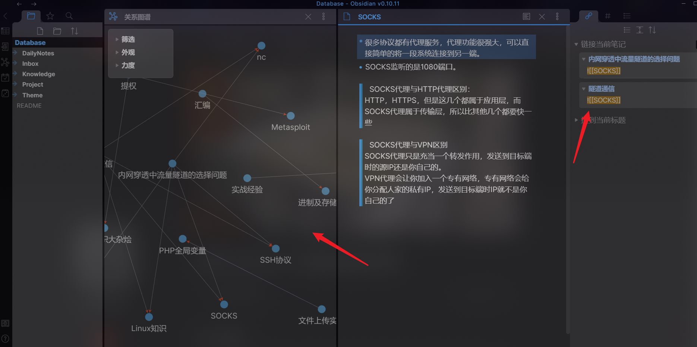
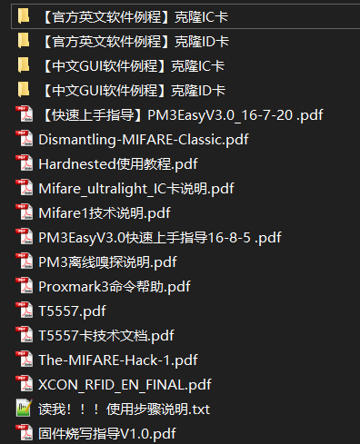

# Sierting_Tools武器库使用指北V1.1


>1.思而听Sec武器库：**Sierting_Tools武器库**（以下简称“武器库”）及**Sierting_Tools武器库使用指北**，是由思而听Sec成员`Resek4`原创编写，“武器库”本身所有权及最终解释权归属于思而听网络科技有限公司所有。
2.您在使用“武器库”的过程中，必须遵循以下原则：
遵守中国有关的法律和法规；不得为任何非法目的而使用“武器库”
遵守所有与“武器库”有关的协议、规定和程序；
3.不得利用“武器库”进行任何可能对互联网的正常运转造成不利影响的行为；
4.不得利用“武器库”进行任何不利于网络安全行业的行为；
5.如您在使用“武器库”时违反任何上述规定，思而听Sec有权要求您改正或直接采取一切必要的措施（包括但不限于更改或删除您使用的测试环境、依法提交使用者信息至相关部门）以减轻您不当行为造成的影响。
6.凡下载，安装，使用本“武器库”，即默认为遵守遵守中华人民共和国网络安全法等相关法律，若违反相关法律，思而听Sec及其所属公司（思而听网络科技有限公司）不承担任何责任！

# 武器库基本介绍
## 武器库配置
本武器库使用的是**Windows 10**，已使用数字永久激活，配置为：

+ 硬盘：`120G`
+ 内存：`8G`（宿主机16G内存标准，如果宿主机8G，内存可在Vmware的 虚拟机->设置->内存 处自行调整为4G）
+ 处理器：`1个*2核，共2核`
+ 网络模式：`NAT模式`

## 账户
### Windows默认用户为：
用户名：`sierting`
密码：`[空]`

关于账户、域、计算机名等内容均保持默认，制作者未作修改

## 系统修改处
### 当前目录打开CMD
+ 在当前文件夹下右键，并选择`在此处打开my_cmd`，即可打开CMD，方便在某个子目录里使用命令行工具
使用以下代码添加了注册表项：
my_cmd.reg
```c
Windows Registry Editor Version 5.00

[HKEY_CLASSES_ROOT\Directory\Background\shell\my_cmd]
@="在此处打开命令行"
"Icon"="cmd.exe"

[HKEY_CLASSES_ROOT\Directory\Background\shell\my_cmd\command]
@="\"C:\\Windows\\System32\\cmd.exe\" \"--cd=%v.\""

[HKEY_CLASSES_ROOT\Directory\shell\my_cmd]
@="在此处打开命令行"
"Icon"="cmd.exe"

[HKEY_CLASSES_ROOT\Directory\shell\my_cmd\command]
@="\"C:\\Windows\\System32\\cmd.exe\" \"--cd=%v.\""
```

# 必看！武器库推荐基本使用风格
## 搭配“思而听启动器”（Lily版）
+ `思而听启动器`依托“Lily启动器”制作，使用`鼠标中键`，即可调出武器库启动菜单，如下图：


其下共有7个大类，各大类下共分为32个子类，如下表所示：

| 大类名称  | 小类名称                                                                    |
| --------- | --------------------------------------------------------------------------- |
| **基础工具**  | 工具、代理转发、Shell管理、SQL、编码解码、CTF工具                           |
| **信息搜集**  | 工具、子域名收集、后台文件扫描、CMS识别利用、资产相关、Github泄露、端口扫描 |
| **漏洞工具**  | 工具、漏洞扫描、文件上传、漏洞利用                                          |
| **内网相关**  | 工具、信息搜集、隧道选择、提权、域控相关                                    |
| **字典&资源** | 字典、Webshell、Powershell工具、浏览器安全插件                              |
| **近源渗透**  | RFID、Badusb                                                                |
| **EXP&POC**   | 其余、安全视频、安全文章、样本分析                                                                            |

>当使用者在渗透过程中想要获取更好工具的使用体验，或者在无头绪如何下一步时，可以遍览启动器不同渗透阶段的工具，在本文档中搜索相关工具的介绍并查看其项目地址。
>或对启动器项目`右键选择打开文件位置`，可以看到不同工具的`Readme.md`

## 搭配utools使用
+ **uTools**是一个插件化工作流程的生产力工具，在渗透测试中往往我们更需要的不是眼花缭乱的工具，而是得心应手熟悉工具的快速调用，utools可以帮我们做到这点。
### 本地搜索
+ 因为武器库安装了`Everything`这个查本地文件的神器，所以可以使用utools自动调用其`本地搜索`插件，简化查找软件、EXP、POC的过程

### 文档速查
+ 在我们学习程序语言的过程中时常会遇见没见过的函数，使用已安装的各种常见语言文档插件，可以快速查找自己不明白的函数名

### 内网穿透
+ utools官方为用户免费提供多个节点可为我们提供内网穿透服务，当自己在本地使用套件（phpstudy等）搭建框架时，通过此服务我们可以将本地地址映射到外网

### 智能面板
+ 长按鼠标右键调出utools的智能面板，现面板预安装了聚合翻译插件。在选中一段外文文字时，可以长按鼠标右键调用智能面板来用`谷歌翻译`、`有道翻译`、`腾讯翻译`对选中的文段进行翻译

### 更多插件供君发掘
+ 武器库为使用者预装了40个利于工作流的插件，更多插件供君发掘


## 搭配Fences3使用
+ Fences是一个高颜值的桌面图标管理软件，思而听武器库在桌面预建立了三个分区：`EXP&POC` ，`工作流`和 `基本渗透工具`，使用者可以在使用时通过按住右键框选桌面一块区域来自定义自己的桌面使用习惯


## 搭配Obsidian使用
>永远为您服务的第二个大脑！
+ **Obsidian**是一个纯文档的Markdown编辑软件
使用者在渗透学习过程中，会遇到很多未曾见过的知识点，一般的笔记软件都存在一些问题，例如：
“收藏即学会，写完即尘封”
“笔记结构单一层面分类”
“知识与知识毫无衔接”

>书籍根本就不是一个好的思想传播方式  
写作之难，在于把“网状”的思考，用“树状”的语法结构，转换成“线性”字符串。  
（The Web,the Tree,and the String）  
而我们读书更像是在进行逆向工程，因为读到的内容是将作者思维网络“编译”后的结果。

而Obsidian采用了**ZK卡片笔记**，**双向链接笔记**（2020年最时髦的笔记法）
它带给我们的不仅仅是渗透单一层面的收获，而是整个网络世界、自己思维模式及效率的多方面提升！

因为知识的层面是多元的，例如今天学到了个 *“免杀shell的编写”*，这则笔记既可以放到 *“渗透测试”*文件夹中，也可以放到*“脚本编程”*文件夹中。它可以作为单独一则笔记，也可以作为*“文件上传漏洞”*这个笔记下的一个子项。

一般笔记软件的树状文件夹存储结构则限制了这则笔记的文件夹归属与知识点归属。但是使用Obsidian的双向链接与ZK卡片特性，使用者无需考虑这点——甚至不用给笔记归类！直接使用所有软件都有的全局搜索笔记功能打开笔记，Obsidian就会自动调出<b>所有与这则笔记相连接的知识点，哪些笔记调用了这则笔记，这则笔记又涉及了其他哪些笔记的知识块</b>
这样一来，呈现在使用者眼中的就不再是单一的笔记，而是整个渗透测试学习的知识网络



更多使用姿势可详见以下链接：
+ [玩转 Obsidian | 打造知识循环利器](https://sspai.com/post/62414)
+ [威廉Obsidian使用心得系列文章总汇（干货满满）](https://zhuanlan.zhihu.com/p/336860525)
+ [Obsidian forum](https://forum.obsidian.md/)（Obidian官方论坛）
# 武器库工具详解
 + 本武器库搭载在`C:\武器库`中，并用`Lily`作为启动器方便使用者更快速的打开工具，Lily本身设置了开机自启动
## 环境
### 语言环境
| 环境          | 项目地址                                                                   |
| ------------- | -------------------------------------------------------------------------- |
| **Python2.7**     | https://www.python.org/downloads/release/python-2718/                      |
| **Python3.8.5**   | https://www.python.org/downloads/release/python-385/                       |
| **Java (jdk8.0)** | https://www.oracle.com/java/technologies/javase/javase-jdk8-downloads.html |
### 渗透&训练环境
+ Metasploit Framework
>**Metasploit Framework**的是用于创建安全工具,并利用开发平台。该框架所使用的网络安全专业人士来执行渗透测试,系统管理员验证补丁的安装,产品供应商执行回归测试和安全研究世界各地。该框架是用Ruby编程语言,包括C和汇编编写的组件。

| 训练环境    | 简介                                                                                                                                                                                               | 项目地址                             |
| ----------- | -------------------------------------------------------------------------------------------------------------------------------------------------------------------------------------------------- | ------------------------------------ |
| Vulstudy    | **Vulstudy**是一个靶场的集合。vulstudy是专门收集当下流行的漏洞学习平台，并将其制作成docker镜像，方便大家快速搭建环境，节省搭建时间，专注于的漏洞学习上。                                           | https://github.com/c0ny1/vulstudy    |
| DVWA        | **DVWA（Damn Vulnerable Web App）** 是一个基于PHP/MySql搭建的Web应用程序，旨在为安全专业人员测试自己的专业技能和工具提供合法的 环境，帮助Web开发者更好的理解Web应用安全防范的过程。                | http://www.dvwa.co.uk/               |
| Sqli-labs   | **Sqli-libs**是一个非常好的SQL注入学习实战平台，涵盖了报错注入、盲注、Update注入、Insert注入、Heather注入、二阶注入、绕过WAF，比较全面的一个注入平台。本次在phpstudy环境上部署sqli-labs 注入平台。 | https://github.com/Audi-1/sqli-labs  |
| upload-labs | **upload-labs**是一个使用php语言编写的，专门收集渗透测试和CTF中遇到的各种上传漏洞的靶场。旨在帮助大家对上传漏洞有一个全面的了解。目前一共20关，每一关都包含着不同上传方式。                        | https://github.com/c0ny1/upload-labs |
| XXE-labs    | **xxe-lab**是一个使用php,java,python,C#四种当下最常用语言的网站编写语言来编写的一个存在xxe漏洞的web demo                                                                                           | https://github.com/c0ny1/xxe-lab     |

## 基础工具
### 浏览器
#### Chrome
**Google Chrome**是一款由Google公司开发的网页浏览器，该浏览器基于其他开源软件撰写，包括WebKit，目标是提升稳定性、速度和安全性，并创造出简单且有效率的使用者界面。

>`插件-内置扩展程序`：

| 图标                        | 名称                                          | 介绍                                                                                                                                                                                                                                                                                                                                                                                                                                                                                                                         |
| --------------------------- | --------------------------------------------- | ---------------------------------------------------------------------------------------------------------------------------------------------------------------------------------------------------------------------------------------------------------------------------------------------------------------------------------------------------------------------------------------------------------------------------------------------------------------------------------------------------------------------------- |
|         | Proxy SwitchyOmega                            | **Proxy SwitchyOmega**可以轻松快捷地管理和切换多个代理设置                                                                                                                                                                                                                                                                                                                                                                                                                                                                   |
|           | IDM Integration Module                        | **Internet Download Manager**可以下载文件，是IDM下载的Chrome内置插件版                                                                                                                                                                                                                                                                                                                                                                                                                                                       |
|    | 类似的网站 - 发现相关网站                     | **类似的网站 - 发现相关网站**可以立即发现与您当前正在浏览的网站类似的网站。探索网络，了解更多信息                                                                                                                                                                                                                                                                                                                                                                                                                            |
|           | X-Forwarded-For Header                        | **X-Forwarded-For Header**使您可以快速设置X-Forwarded-For HTTP标头                                                                                                                                                                                                                                                                                                                                                                                                                                                           |
|         | Whois Website Hosting Company Info & IP Whois | **Whois Website Hosting Company Info & IP Whois**是一个Whois查询插件                                                                                                                                                                                                                                                                                                                                                                                                                                                         |
|        | WebRTC Network Limiter                        | **WebRTC Network Limiter**可以通过更改Chrome的隐私设置来配置WebRTC的网络流量路由方式，WebRTC是一个用于语音及视频通信的网络协议，而这个插件可以避免因为此协议漏洞而导致的用户真实IP泄露                                                                                                                                                                                                                                                                                                                                       |
|          | Wappalyzer                                    | **Wappalyzer**可以识别所运用到的网络技术                                                                                                                                                                                                                                                                                                                                                                                                                                                                                     |
|    | User-Agent Switcher for Chrome                | **User-Agent Switcher for Chrome**可以更便捷的更改UA头，实现欺骗&模仿其他用户代理的功能                                                                                                                                                                                                                                                                                                                                                                                                                                      |
|  | Tampermonkey                                  | **Tampermonkey**是世界上最受欢迎的用户脚本管理器                                                                                                                                                                                                                                                                                                                                                                                                                                                                             |
|    | SimilarWeb                                    | **SimilarWeb**可以查看流量来源和网站排名等信息                                                                                                                                                                                                                                                                                                                                                                                                                                                                               |
|        | Shodan                                        | **Shodan**是用来搜索网络空间中在线设备的工具，你可以通过 Shodan 搜索指定的设备，或者搜索特定类型的设备，其中 Shodan 上最受欢迎的搜索内容是：webcam，linksys，cisco，netgear，SCADA等等。                                                                                                                                                                                                                                                                                                                                     |
|    | ScriptSafe                                    | **ScriptSafe**是一款脚本监控插件，可以使用户在浏览过程中滤掉加载图片和视频，只留下网页中的文字，是网络流量更安全的chrome插件                                                                                                                                                                                                                                                                                                                                                                                                 |
|          | JSON Viewer Awesome                           | **JSON Viewer Awesome**是一款美化JSON体验的插件                                                                                                                                                                                                                                                                                                                                                                                                                                                                              |
|          | IP 域国家国旗                                 | **IP 域国家国旗**可以显示国家船旗国和其他 IP / 域信息栏中的位置。                                                                                                                                                                                                                                                                                                                                                                                                                                                            |
|      | Infinity 新标签页                             | **Infinity 新标签页**是百万用户选择的新标签页插件，自由添加网站图标，云端高清壁纸，快速访问书签、天气、笔记、待办事项、扩展管理与历史记录。                                                                                                                                                                                                                                                                                                                                                                                  |
|       | HackBar                                       | **HackBar**是一款渗透测试网络安全的小工具。                                                                                                                                                                                                                                                                                                                                                                                                                                                                                  |
|  | Chrome Poster                                 | **Chrome Poster**可以发送POST请求包，自定义HTTP消息头                                                                                                                                                                                                                                                                                                                                                                                                                                                                        |
|       | Charset                                       | **Charset**可以修改网站的默认编码                                                                                                                                                                                                                                                                                                                                                                                                                                                                                            |
|           | ApiDebug - Http Test                          | **ApiDebug**是一个完全开源免费的接口调试插件，该插件可独立使用，数据支持本地存储也可同步至云端。支持post、get、xml、josn等测试。                                                                                                                                                                                                                                                                                                                                                                                             |
|    | LeakFinder（觅露）                            | **LeakFinder（觅露）** 为s7ck Team 红队云武器库F-Box里的一款信息泄露浏览搜集浏览器插件。信息泄露一直是红队测试人员打开大门的关键，无论是git，svn，还是网站备份等等都，都大大提升了打开大门的可能性。 在实战过程中，海量的信息面临着整理不全，无法准确分类，不能通过软件批量扫描等等，故从新改写了donot师傅谷歌浏览器插件：sensinfo，解决了一些实战当中可能面临的问题。项目地址：*https://github.com/s7ckTeam/LeakFinder*                                                                                                     |
|     | HackTools                                     | **HackTools(如当)** 为s7ck Team 红队武器库F-Box里的一款汉化的红队浏览器插件。 取名为如当是希望这个插件能帮助红队测试人员目光如豆，独当一面。 在红队作战中，计算，生成payload，编码转换，cve搜索，如何快速的执行命令等会占用大部分宝贵的时间，在命令行不是特别熟练的情况下，需要有一款插件，或一款集成的工具来提醒、提示红队人员将要使用到的命令 HackTools是一个用于web应用程序渗透测试的web插件，它包括渗透测试期间使用的大部分工具，如XSSpayload、反弹shell payload等等。项目地址：*https://github.com/s7ckTeam/HackTools/* |

#### Firefox
插件如下，介绍同上
+ **HackBar**
+ **Proxy SwitchyOmega**

### 工具
#### XShell
+ **XShell**是一个强大的安全终端模拟软件，它支持SSH1,SSH2，以及Microsoft Windows平台的TELNET协议。  XShell可以在Windows界面下用来访问远端不同系统下的服务器，从而比较好的达到远程控制终端的目的。由于在虚拟机中操作Linux系统需要频繁切换鼠标，缺乏个性化设置，不支持中文显示，所以我们将使用XShell来连接并使用安装好Linux系统的虚拟机。

#### IDM 
+ **IDM**，全称Internet Download Manager，一款PC端多线程下载神器，其原理就是通过多线程分工式下载单一资源以达到高速下载的效果。                                 
#### Xmind8
+ **Xmind**是一款简单好用的思维导图软件，除了可以轻松绘制基本逻辑图，还支持组织结构图（竖直）、树状图（水平+竖直）、思维导图（辐射）、鱼骨图、二维图（表格）模型。免费版可以把思维导图导出为图片格式，会员版除了能导出图片，还可以导出Word、Excel、PPT格式。           
#### 夜神模拟器
+ **夜神安卓模拟器**是一个可以让手机应用程序运行在电脑上的软件

#### Arduino(IDE) 
+ **Arduino** 是一款便捷灵活、方便上手的开源电子原型平台，包含硬件（各种型号的arduino板）和软件（arduino IDE)，她适用于艺术家、设计师、爱好者和对于“互动”有兴趣的朋友们。需搭配Arduino开发板硬件使用   

#### VNC Viewer
+ **VNC (Virtual Network Console)**是虚拟网络控制台的缩写。其中，VNC viewer就相当于是虚拟网络控制台的应用程序。   

#### Xftp 
+ **Xftp**是一个功能强大的SFTP、FTP 文件传输软件。使用了 Xftp 以后，MS Windows 用户能安全地在 UNIX/Linux 和 Windows PC 之间传输文件。Xftp 能同时适应初级用户和高级用户的需要。它采用了标准的 Windows 风格的向导，它简单的界面能与其他 Windows 应用程序紧密地协同工作，此外它还为高级用户提供了众多强劲的功能特性。

#### Potplayer
+ **PotPlayer** 的优势在于强大的内置解码器；而 KMPlayer 的优势在于强大的定制能力和个性化功能。PotPlayer 使用 VC++ 编写， KMPlayer 为 Delphi 编写。

#### 7-zip 
+ **7-Zip**是一款完全免费而且开源的压缩软件，相比其他软件有更高的压缩比而且相对于WinRAR不会消耗大量资源。

#### Tor Browser
+ **Tor Browser洋葱浏览器**，洋葱浏览器是Tor项目组发布的一款基于火狐浏览器的浏览器。

#### phpstudy
+ **phpStudy**是一个PHP调试环境的程序集成包。该程序包集成最新的Apache+PHP+MySQL+phpMyAdmin+ZendOptimizer，一次性安装，无须配置即可使用，是非常方便、好用的PHP调试环境。该程序不仅包括PHP调试环境，还包括了开发工具、开发手册等。

#### Notepad++
+ **Notepad++**是Windows操作系统下的一套文本编辑器(软件版权许可证: GPL)，有完整的中文化接口及支持多国语言编写的功能(UTF8技术)。

#### Sublime Text
+ **Sublime Text **是一个文本编辑器（收费软件，可以无限期试用，但是会有激活提示弹窗），同时也是一个先进的代码编辑器。Sublime Text是由程序员Jon Skinner于2008年1月份所开发出来，它最初被设计为一个具有丰富扩展功能的Vim。

#### Obsidian
+ 永远为您服务的第二个大脑！
**Obsidian**是一个在本地运行的纯文本Markdown编辑器，采用了时下最时髦的==双向链接==笔记模式，它可以作为一个强大的知识库而存在。

#### Snipaste
+ **Snipaste**是一个快速截图工具。当它在托盘运行时，我们可以通过两种方式激活截图工具，分别是：默认快捷键 F1 或单击托盘图标。

#### utools
+ **uTools**是你的生产力工具集，自由集成丰富插件，快速匹配「场景功能」，用完即走。极简、插件化、跨平台，通过自由选配丰富的插件，打造你得心应手的工具集合。当你熟悉它后，能够为你节约大量时间，让你可以更加专注地改变世界。

#### Fences
+ **Fences**通过将快捷方式和图标自动放置在桌面上各个可调整大小的分区（称为围栏）中来帮助您整理PC桌面。它的许多自定义功能使Fences成为世界上最受欢迎的Windows桌面增强工具。
### 抓包及流量分析
| 名称      | 简介                                                                                                                                                                                                         | 项目地址                        |
| --------- | ------------------------------------------------------------------------------------------------------------------------------------------------------------------------------------------------------------ | ------------------------------- |
| Burpsuite | **Burp Suite**是用于攻击web 应用程序的集成平台，包含了许多工具。Burp Suite为这些工具设计了许多接口，以加快攻击应用程序的过程。所有工具都共享一个请求，并能处理对应的HTTP 消息、持久性、认证、代理、日志、警报。 | https://portswigger.net/burp    |
| Fiddler   | **Fiddler**是一个http协议调试代理工具，它能够记录并检查所有你的电脑和互联网之间的http通讯，设置断点，查看所有的“进出”Fiddler的数据（指cookie,html,js,css等文件）。                                               | https://www.telerik.com/fiddler |
| Wireshark | **Wireshark**（前称Ethereal）是一个网络封包分析软件。网络封包分析软件的功能是撷取网络封包，并尽可能显示出最为详细的网络封包资料。Wireshark使用WinPCAP作为接口，直接与网卡进行数据报文交换。                      | https://www.wireshark.org/      |
| Brim      | **Brim**是一款由美国供应商 Brim Security开发并开源的流量分析工具,可以轻松处理非常大的数据包捕获(pcap)文件。                                                                                                   | https://www.brimsecurity.com/   |


### 代理转发
| 名称       | 简介                                                                                                                                                                                                                                                                                   | 项目地址                                       |
| ---------- | -------------------------------------------------------------------------------------------------------------------------------------------------------------------------------------------------------------------------------------------------------------------------------------- | ---------------------------------------------- |
| Clash      | **Clash**是一款用 Go开发的支持 Linux/MacOS/Windows等多平台的代理工具，支持 ss/v2ray/snell（不支持 ssr），支持规则分流（类似于 Surge 的配置）。                                                                                                                                             | https://github.com/Dreamacro/clash             |
| v2rayN     | **v2rayN** 是Windows平台上一款基于v2ray核心的简洁好用、功能强大的v2ray客户端，支持Vmess、Shadowsocks、Socks5等多种协议，也支持服务器订阅。                                                                                                                                             | https://github.com/2dust/v2rayN                |
| EarthWorm  | **EarthWorm(ew)** 是一款用于开启 SOCKS v5 代理服务的工具，基于标准 C 开发，可提供多平台间的转接通讯，用于复杂网络环境下的数据转发。                                                                                                                                                         | http://rootkiter.com/EarthWorm/                |
| reGrorg    | **reGeorg**利用了会话层的socks5协议,提供了PHP、ASPX、JSP脚本,效率很高。就像我们平常使用的reDuh、tunna，和reGeorg一样，都是正向代理。一般都是用户上传一个代理脚本到服务器端，本地的程序去连接服务器上的脚本，脚本程序做代理转发端口和流量。 | https://github.com/sensepost/reGeorg           |
| Proxifier  | **Proxifier**是一款功能非常强大的socks5客户端，可以让不支持通过代理服务器工作的网络程序能通过HTTPS或SOCKS代理或代理链。                                                                                                                                                                    | https://www.proxifier.com/download/            |
| SocksCap64 | **SocksCap64**是一款代理软件，能让指定软件走socks代理。 与VPN不同的是，VPN连接后会断一次网，类似ADSL拨号，而**SocksCap64**可以让指定的某软走代理连接，同时支持TCP和UDP，因此可以用来做游戏加速。                                                                                       | https://www.sockscap64.com/homepage/           |
| SSTap      | **SSTap**支持SS/SSR全局代理，配置简单，简单快速的将SSR变成游戏加速器    

### shell相关
| 名称               | 简介                                                                                                                                                                                                                                                                                                                                                                                                                                               | 项目地址                                                               |
| ------------------ | -------------------------------------------------------------------------------------------------------------------------------------------------------------------------------------------------------------------------------------------------------------------------------------------------------------------------------------------------------------------------------------------------------------------------------------------------- | ---------------------------------------------------------------------- |
| Behinder（冰蝎）   | **冰蝎（Behinder）** 是国内黑客圈较火的一款Webshell管理工具。在2020HVV开始前，冰蝎突然进行了3.0版本的发布，新版本修改了不少旧版本的流量特征，导致大量WAF、HIDS、Webshell检测工具失效。                                                                                                                                                                                                                                                                  | https://github.com/rebeyond/Behinder/releases/tag/Behinder_v3.0_Beta_6 |
| 中国菜刀           | **中国菜刀**是一款专业的网站管理软件，用途广泛，使用方便，小巧实用。只要支持动态脚本的网站，都可以用中国菜刀来进行管理！在非简体中文环境下使用，自动切换到英文界面。UNICODE方式编译，支持多国语言输入显示。                                                                                                                                                                                                                                            | 略                                                                     |
| AntSword（中国蚁剑）           | **AntSword（中国蚁剑）** 是一款开源的跨平台网站管理工具，它主要面向于合法授权的渗透测试安全人员以及进行常规操作的网站管理员。是一款非常优秀的webshell管理工具                                                                                                                                                                                                                                                                                                       | https://github.com/AntSwordProject/AntSword-Loader                     |
| D盾                | **D盾**是目前最为流行和好用的web查杀工具，同时使用也简单方便，在web应急处置的过程中经常会用到。D盾的功能比较强大， 最常见使用方式包括如下功能：1、查杀webshell，隔离可疑文件；2、端口进程查看、base64解码以及克隆账号检测等辅助工具；3、文件监控。第一个是D盾的主要功能，后面功能是D盾的辅助功能，但是在处理web甚至是病毒的过程中可能都会用到。本文从详细说明D盾的使用过程，并配套录制视频供大家使用。                                                 | http://www.d99net.net/News.asp?id=47                                   |
| php-malware-finder | **PHP-malware-finder**是一款优秀的检测webshell和恶意软件混淆代码的工具，比如以下组件都可以被检测发现。                                                                                                                                                                                                                                                                                                                                                | https://github.com/jvoisin/php-malware-finder                          |
| weevely            | **weevely**是一款使用python编写的webshell工具，集webshell生成和连接于一身，采用c/s模式构建，可以算作是linux下的一款php菜刀替代工具，具有很好的隐蔽性（生成随机参数且base64加密），在linux上使用时还是很给力的（集服务器错误配置审计，后门放置，暴力破解，文件管理，资源搜索，网络代理，命令执行，数据库操作，系统信息收集及端口扫描等功能），就是某些模块在windows上无法使用，总的来说还是非常不错的一款工具（仅用于安全学习教学之用，禁止非法用途）。 | https://github.com/epinna/weevely3                                     |

### SQL
| 名称              | 简介                                                                                                                                                                                                                         | 项目地址                                        |
| ----------------- | ---------------------------------------------------------------------------------------------------------------------------------------------------------------------------------------------------------------------------- | ----------------------------------------------- |
| Sqlmap            | **sqlmap**是一个自动化的SQL注入工具，其主要功能是扫描，发现并利用给定的URL的SQL注入漏洞，目前支持的数据库是MySQL, Oracle, PostgreSQL, Microsoft SQL Server, Microsoft Access, IBM DB2, SQLite, Firebird, Sybase和SAP MaxDB。 | http://sqlmap.org/                              |
| Navicat Premium15 | **Navicat Premium**是一款数据库管理工具,是一个可多重连线资料库的管理工具，它可以让你同时连线到 MySQL、SQLite、Oracle 及 PostgreSQL 数据库，让管理不同类型的数据库更加的方便。                                                | http://www.navicat.com.cn/store/navicat-premium |

### 编码解码
+ 内部工具收集自网络，请谨慎使用

### CTF工具
+ 内部工具收集自网络，请谨慎使用，有以下分类：
	+ 脚本
	+ 隐写（图像、视频、音频）
	+ 流量分析
	+ 文件分析
	+ 逆向
	+ 取证
	+ 线下

## 信息搜集
### 工具-URL采集
>软件来自于网络，不做介绍，可对搜索内容进行URL采集

| 名称                     |
| ------------------------ |
| **url采集**                  |
| **百度&谷歌URL批量获取工具** |
### 子域名收集
| 名称              | 简介                                                                                                                                                                                                                                                     | 项目地址                                                          |
| ----------------- | -------------------------------------------------------------------------------------------------------------------------------------------------------------------------------------------------------------------------------------------------------- | ----------------------------------------------------------------- |
| Layer子域名挖掘机 | **Layer子域名挖掘机**是一款域名查询工具，可提供网站子域名查询服务；拥有简洁的界面、简单的操作模式，支持服务接口、暴力搜索、同服挖掘三种模式，支持打开网站、复制域名、复制IP、复制CDN、导出域名、导出IP、导出域名+IP、导出域名+IP+WEB服务器以及导出存活网站！ | 略                                                                |
| OneForAll         | **OneForAll**是一款功能强大的子域收集工具                                                                                                                                                                                                                | https://github.com/shmilylty/OneForAll                            |
| subDomainBrute    | **subDomainBrute**依赖于dnspython插件，用于子域名爆破                                                                                                                                                                                                                  | https://github.com/lijiejie/subDomainsBrute                       |
| subfinder         | **subfinder**是用来查询域名的子域名信息的工具，可以使用很多国外安全网站的api接口进行自动化搜索子域名信息                                                                                                                                                   | https://github.com/projectdiscovery/subfinder#direct-installation |
| Sublist3r         | **Sublist3r**是一个python版工具，其设计原理是基于通过使用搜索引擎，从而对站点子域名进行列举。**                                                                                                                                                            | https://github.com/aboul3la/Sublist3r                             |

### 后台文件扫描
| 名称      | 简介                                                                                                                                                                               | 项目地址                                |
| --------- | ---------------------------------------------------------------------------------------------------------------------------------------------------------------------------------- | --------------------------------------- |
| dirmap    | **dirmap**是一个高级web目录扫描工具，功能将会强于DirBuster、Dirsearch、cansina、御剑                                                                                                           | https://github.com/H4ckForJob/dirmap    |
| dirsearch | **dirsearch**是一个基于python的命令行工具，用于暴力扫描页面结构，包括网页中的目录和文件。                                                                                              | https://github.com/maurosoria/dirsearch |
| 御剑后台  | **御剑后台扫描珍藏版**是T00LS大牛的作品,方便查找用户后台登陆地址，同时也为程序开发人员增加了难度，尽量独特的后台目录结构。附带很强大的字典，字典我们也是可以自己修改的，继续增加规则。 | 略                                      |

### CMS识别利用
| 名称                  | 简介                                                                                                               | 项目地址                                        |
| --------------------- | ------------------------------------------------------------------------------------------------------------------ | ----------------------------------------------- |
| CMS-Exploit-Framework | **CMS Exploit Framework**是一款 CMS 漏洞利用框架，通过它可以很容易地获取、开发 CMS 漏洞利用插件并对目标应用进行测试。 | https://github.com/Q2h1Cg/CMS-Exploit-Framework |
| CMS-Hunter            | **CMS-Hunter**是一款挖掘CMS漏洞工具                                                                                                    | https://github.com/SecWiki/CMS-Hunter           |
| cmsPoc                | **cmsPoc**是一个cms漏洞poc管理和检测工具                                                                                       | https://github.com/CHYbeta/cmsPoc               |
| XAttacker             | **XAttacker**是一款网站漏洞扫描并自动化工具                                                                                           | https://github.com/Moham3dRiahi/XAttacker       |

### 资产相关
| 用途     | 名称          | 简介                                                                                                                                                                                                                                                                                                                                                                                                                                                                                      | 项目地址                                   |
| -------- | ------------- | ----------------------------------------------------------------------------------------------------------------------------------------------------------------------------------------------------------------------------------------------------------------------------------------------------------------------------------------------------------------------------------------------------------------------------------------------------------------------------------------- | ------------------------------------------ |
| 资产收集 | goby          | **Goby**是基于网络空间映射技术的下一代网络安全工具。它通过为目标网络建立全面的资产知识库来生成对网络安全事件和漏洞的紧急响应。Goby提供最全面的资产识别.Goby预置了100,000多个规则识别引擎，可自动识别和分类硬件设备和软件业务系统，并全面分析网络中存在的业务系统。Goby提供了最快的扫描体验，对目标的影响最小，并通过非常轻的传输快速分析了与端口相对应的协议信息。除了Goby的预设漏洞外，Goby还提供了一个可自定义的漏洞扫描框架，并激励大量网络安全从业人员提供POC，以确保持续的紧急响应能力。 | https://gobies.org/                        |
|          | Glass         | **Glass**是一款针对资产列表的快速指纹识别工具，通过调用Fofa/ZoomEye/Shodan/360等api接口快速查询资产信息并识别重点资产的指纹，也可针对IP/IP段或资产列表进行快速的指纹识别。Glass旨在帮助红队人员在资产信息收集期间能够快速从C段、大量杂乱的资产中精准识别到易被攻击的系统，从而实施进一步测试攻击。                                                                                                                                                                                            | https://github.com/s7ckTeam/Glass                                           |
| 资产管理 | bayonet       | **Bayonet**是整合多款安全工具并以web形式展现，它辅助渗透测试人员对IT资产进行资产管理。                                                                                                                                                                                                                                                                                                                                                                                                        | https://github.com/CTF-MissFeng/bayonet    |
| 资产监控 | LangSrcCurise | **LangSrcCurise**资产监控系统是一套通过网络搜索引擎监控其下指定域名，并且能进行持续性信息收集整理的自动化资产监控管理系统，基于Django开发。                                                                                                                                                                                                                                                                                                                                                   | https://github.com/LangziFun/LangSrcCurise |

### github敏感信息搜集
| 名称            | 简介                                                                                                                                                                                                | 项目地址                               |
| --------------- | --------------------------------------------------------------------------------------------------------------------------------------------------------------------------------------------------- | -------------------------------------- |
| Gitprey         | **GitPrey**是根据企业关键词进行项目检索以及相应敏感文件和敏感文件内容扫描的工具，其设计思路                                                                                                             | https://github.com/repoog/GitPrey      |
| GSIL            | **GSIL**可以近实时监控GitHub敏感信息泄露，并发送告警通知。                                                                                                                                                      | https://github.com/FeeiCN/GSIL         |
| gitrob          | **Gitrob**是一个Github潜在敏感信息泄漏扫描工具。Gitrob将属于用户或组织的存储库克隆到可配置的深度，并遍历提交历史记录/标记与潜在敏感文件的签名匹配的文件。调查结果将通过网络界面呈现，以便于浏览和分析。 | https://github.com/michenriksen/gitrob |
| truffleHog-dev  | **truffleHog-dev**可以帮助开发人员检测他们在GitHub上发布的项目是否已经不小心泄漏了任何秘密密钥。                                                                                      | https://github.com/dxa4481/truffleHog  |
| svn_git_scanner | **svn_git_scanner**用于全球svn，git信息泄露扫描，基于多线程，带宽控制，代理线程池支持                                                                                                                                  | https://github.com/shengqi158/svn_git_scanner                                       |

### 端口扫描
| 名称    | 简介                                                                                                                                                                                                                                                     | 项目地址                                     |
| ------- | -------------------------------------------------------------------------------------------------------------------------------------------------------------------------------------------------------------------------------------------------------- | -------------------------------------------- |
| Nmap    | **Nmap**是一个网络连接端扫描软件，用来扫描网上电脑开放的网络连接端。确定哪些服务运行在哪些连接端，并且推断计算机运行哪个操作系统（这是亦称 fingerprinting）。它是网络管理员必用的软件之一，以及用以评估网络系统安全。                                        | https://nmap.org/download.html               |
| Masscan | **masscan**号称是世界上最快的扫描软件，可以在3分钟内扫描整个互联网端口，但是这个是由条件的4核电脑，双端口10G网卡。masscan相比nmap之所以快很多，masscan采用了异步传输方式，无状态的扫描方式。nmap需要记录tcp/ip的状态，os能够处理的TCP/IP连接最多为1500左右。 | https://github.com/robertdavidgraham/masscan |

## 漏洞工具
### 漏洞工具&扫描
| 名称             | 简介                                                                                                                                                                                                                                                                                                                                                | 项目地址                                        |
| ---------------- | --------------------------------------------------------------------------------------------------------------------------------------------------------------------------------------------------------------------------------------------------------------------------------------------------------------------------------------------------- | ----------------------------------------------- |
| AWVS             | **AWVS**是自动化应用程序安全测试工具，支持windows平台，主要用于扫描web应用程序上的安全问题，如SQL注入，XSS，目录遍历，命令注入等。                                                                                                                                                                                                                      | https://www.acunetix.com/vulnerability-scanner/ |
| Appscan          | **AppScan**是IBM的一款web安全扫描工具，具有利用爬虫技术进行网站安全渗透测试的能力，能够根据网站入口自动摸取网页链接进行安全扫描，提供了扫描、报告和修复建议等功能。appscan有自己的用例库，版本越新用例库月全，针对漏洞的检测越全面，被检测系统的安全性相关较高，目前网上流传的最新版本是9，appscan为IBM一款商业用途的安全扫描工具，但是网络存在破解版。 | 略                                              |
| Railgun          | **Railgun**为一款GUI界面的渗透工具，将部分人工经验转换为自动化，集成了渗透过程中常用到的一些功能，目前集成了端口扫描、端口爆破、web指纹扫描、漏洞扫描、漏洞利用以及编码转换功能，后续会持续更新。                                                                                                                                                       | https://github.com/lz520520/railgun             |
| Struts2-Scan     | **Struts**全漏洞扫描                                                                                                                                                                                                                                                                                                                                    | https://github.com/HatBoy/Struts2-Scan          |
| Szhe_Scan        | **碎遮SZhe\_Scan Web漏洞扫描器**基于python flask框架，对输入的域名或IP进行自动化信息搜集与漏洞扫描，支持添加POC进行漏洞检测。                                                                                                                                                                                                                         | https://github.com/Cl0udG0d/SZhe_Scan           |
| Xray             | **xray** 是从长亭洞鉴核心引擎中提取出的社区版漏洞扫描神器，支持主动、被动多种扫描方式，自备盲打平台、可以灵活定义 POC，功能丰富，调用简单，支持 Windows / macOS / Linux 多种操作系统，可以满足广大安全从业者的自动化 Web 漏洞探测需求。                                                                                                             | https://github.com/atom-archive/xray            |
| crawlergo_x_XRAY | **crawlergo**动态爬虫 结合 长亭XRAY扫描器的被动扫描功能 (其它被动扫描器同理)                                                                                                                                                                                                                                                                            | https://github.com/0Kee-Team/crawlergo                                                |

### 文件上传
| 名称       | 简介                                                                                                                                                                            | 项目地址                               |
| ---------- | ------------------------------------------------------------------------------------------------------------------------------------------------------------------------------- | -------------------------------------- |
| fuxploider | **Fuxploider**是一种开源渗透测试工具，可自动检测和利用文件上传表单缺陷。 此工具能够检测允许上载的文件类型，并能够检测哪种技术最适合在所需的Web服务器上上传Web shell或任何恶意文件。 | https://github.com/almandin/fuxploider |

### 漏洞利用
| 名称      | 简介                                                                                                                                                                              | 项目地址                                   |
| --------- | --------------------------------------------------------------------------------------------------------------------------------------------------------------------------------- | ------------------------------------------ |
| Gr33k     | **Gr33k**是一个图形化的漏洞利用集成工具，它用python3书写，参考了大量安全工具的实现原理与思想，在工作之余开发，方便自己的渗透测试工作，我的目的是打造一个红队武器化工具，路还很长，慢慢更新！ | https://github.com/lijiaxing1997/Gr33k     |
| Netcat    | **Netcat**是一款非常出名的网络工具，简称“NC”,有渗透测试中的“瑞士军刀”之称。 它可以用作端口监听、端口扫描、远程文件传输、还可以实现远程shell等功能。                           | 略                                           |
| thc-hydra | **Hydra**是一个并行登录破解器，支持多种攻击协议。它非常快速和灵活，新模块易于添加。该工具使研究人员和安全顾问能够展示远程获得对系统未经授权的访问是多么容易。                         | https://github.com/vanhauser-thc/thc-hydra |

### 武器甜点-渗透挖洞中用到的小工具
| 名称     | 简介                                                                                                                                                                                                                                                                                        | 项目地址                                    |
| -------- | ------------------------------------------------------------------------------------------------------------------------------------------------------------------------------------------------------------------------------------------------------------------------------------------- | ------------------------------------------- |
| httprobe | **httprobe**可以获取域列表，并探查可正常使用的http和https服务器。                                                                                                                                                                                                                                           | https://github.com/tomnomnom/httprobe       |
| JSFinder | **JSFinder**可以从js文件中寻找敏感接口和子域名                                                                                                                                                                                                                                                              | https://github.com/Threezh1/JSFinder        |
| rtfm     | **Reading The Fucking Manual**                                                                                                                                                                                                                                                                  | https://github.com/leostat/rtfm             |
| wfuzz    | **Wfuzz**是一个基于Python的Web爆破程序，它支持多种方法来测试WEB应用的漏洞。你可以审计参数、登录认证、GET/POST方式爆破的表单，并且可以发掘未公开的资源，比如目录、文件和头部之类的。 | https://github.com/xmendez/wfuzz            |
| XSStrike | **XSStrike**是一款用于探测并利用XSS漏洞的脚本                                                                                                                                                                                                                                              | https://www.freebuf.com/sectool/142044.html |
| HRSword  | **火绒剑**是一款用于分析、处理程序的安全工具。它提供了“程序行为监控”、“进程管理”、“启动项管理”、“内核程序管理”、“钩子扫描”、“服务管理”、“驱动扫描”、“网络监控”、“文件管理”、“注册表管理”十大功能。                                                                                              | 火绒安全软件插件                            |

## 内网相关
### 工具-后渗透结合
| 名称           | 简介                                                                                                                                                                                                                                                                                                                                                                                    | 项目地址                                         |
| -------------- | --------------------------------------------------------------------------------------------------------------------------------------------------------------------------------------------------------------------------------------------------------------------------------------------------------------------------------------------------------------------------------------- | ------------------------------------------------ |
| BetterBackdoor | **BetterBackdoor**是一款多功能的后门工具，广大安全研究人员可以利用BetterBackdoor来获取目标设备的远程访问权限。一般来说，后门工具会利用类似NetCat这样的实用工具来实现两大主要功能：使用cmd或bash来实现控制命令的远程传递并接收响应信息。这种方式实现起来很容易，但是也会受到各种因素的限制。而BetterBackdoor成功克服了这种限制，并引入了击键注入、获取屏幕截图、传输文件以及其他的渗透任务。 | https://github.com/thatcherclough/BetterBackdoor |
| Cobalt Strike  | **Cobalt Strike**是一款以Metasploit为基础的GUI框架式渗透测试工具，集成了端口转发、服务扫描，自动化溢出，多模式端口监听，exe、powershell木马生成等。                                                                                                                                                                                                                                          | https://www.cobaltstrike.com/                    |
| Ladon7.0       | **Ladon**一款用于大型网络渗透的多线程插件化综合扫描神器，含端口扫描、服务识别、网络资产、密码爆破、高危漏洞检测以及一键GetShell，支持批量A段/B段/C段以及跨网段扫描，支持URL、主机、域名列表扫描。                                                                                                                                                                                           | https://github.com/k8gege/Ladon                  |
| mimikatz       | **Mimikatz**是一款后渗透测试工具能够从windows认证(LSASS)的进程中获取内存，并且获取明文密码和NTLM哈希值的工具。                                                                                                                                                                                                                                                                              | https://github.com/gentilkiwi/mimikatz           |
| Perun          | **Perun**是一款主要适用于**乙方安服、渗透测试人员和甲方RedTeam红队人员的网络资产漏洞扫描器/扫描框架**，它主要适用于**内网环境**，加载漏洞检测Vuln模块后能够快速发现安全问题，并根据需要生成报表，以方便安全人员对授权项目完成测试工作。                                                                                                                                                 | https://github.com/WyAtu/Perun                   |
| smbexec        | **Smbexec V2.0**是一款基于psexec的域渗透测试工具                                                                                                                                                                                                                                                                                                                                      | https://github.com/brav0hax/smbexec              |
| SpoolSample    | **SpoolSample**是Lee Christensen开发的一款工具，是现在唯一公开的、能够向无约束服务器发起身份认证的poc代码                                                                                                                                                                                                                                                                                   | https://github.com/leechristensen/SpoolSample    |
| Rubeus         | **Rubeus**是一个用于在流量和主机级别上操控 Kerberos 各种组件的工具，它兼容 C# 3.0 版本（对应.NET 3.5版本）。                                                                                                                                                                                                                                                                                | https://github.com/GhostPack/Rubeus              |
| vssadmin       | **wbadmin**作为应用程序，在备份的时候调用vssadmin进行卷影副本备份, 创建分区还原点也是利用了vssadmin。   
### 信息搜集
#### 探测存活
| 简介                                                                                                                                                                                                                                                                                                                                                                                                                                                                                                                                                                                                                                  | 项目地址                                        |
| ------------------------------------------------------------------------------------------------------------------------------------------------------------------------------------------------------------------------------------------------------------------------------------------------------------------------------------------------------------------------------------------------------------------------------------------------------------------------------------------------------------------------------------------------------------------------------------------------------------------------------------- | ----------------------------------------------- |
| **ADFind**是一款命令行Active Directory查询工具                                                                                                                                                                                                                                                                                                                                                                                                                                                                                                                                                                                        | https://www.joeware.net/freetools/tools/adfind/ |
| **arp-scan**是Kali Linux自带的一款ARP扫描工具。该工具可以进行单一目标扫描，也可以进行批量扫描。批量扫描的时候，用户可以通过CIDR、地址范围或者列表文件的方式指定。该工具允许用户定制ARP包，构建非标准数据包。同时，该工具会自动解析Mac地址，给出MAC对应的硬件厂商，帮助用户确认目标。                                                                                                                                                                                                                                                                                                                                                  | https://github.com/royhills/arp-scan            |
| **nbtscan**是一款用于扫描Windows网络上NetBIOS名字信息的程序。该程序对给出范围内的每一个地址发送NetBIOS状态查询，并且以易读的表格列出接收到的信息，对于每个响应的主机，NBTScan列出它的IP地址、NetBIOS计算机名、登录用户名和MAC地址。但只能用于局域网,NBTSCAN可以取到PC的真实IP地址和MAC地址，如果有”ARP攻击”在做怪，可以找到装有ARP攻击的PC的IP/和MAC地址。但只能用于局域网,NBTSCAN可以取到PC的真实IP地址和MAC地址，如果有”ARP攻击”在做怪，可以找到装有ARP攻击的PC的IP/和MAC地址。NBTSCAN可以取到PC的真实IP地址和MAC地址，如果有”ARP攻击”在做怪，可以找到装有ARP攻击的PC的IP/和MAC地址。总之，NBTSCAN可以取到PC的真实IP地址和MAC地址。 | http://unixwiz.net/tools/nbtscan.html           |

#### 域管理员定位
| 名称                  | 简介                                                                                                                     | 项目地址                                                               |
| --------------------- | ------------------------------------------------------------------------------------------------------------------------ | ---------------------------------------------------------------------- |
| ADFindUsersLoggedOn   | **ADFindUsersLoggedOn**可以查找域用户位置、某计算机上登录用户。运行需要计算机支持framework2.0且以管理员权限运行                                     | https://github.com/chrisdee/Tools/tree/master/AD/ADFindUsersLoggedOn   |
| netview               | **netview**用于域管理员定位                                                                                                             | https://github.com/mubix/netview                                       |
| PowerView             | **PowerView**可以参考PowerTools                                                                                                           | https://github.com/PowerShellEmpire/PowerTools/tree/master/PowerView   |
| smb-enum-sessions.nse | **smb-enum-sessions.nse**是nmap自带工具，通过smb获取域内主机的用户登录session，查看当前是否有用户登录，对于我们抓取用户hash以及避免同时登陆被用户发现。 | https://github.com/nmap/nmap/blob/master/scripts/smb-enum-sessions.nse |

#### 域进程查询
| 名称                 | 简介 | 项目地址                                                   |
| -------------------- | ---- | ---------------------------------------------------------- |
| GetDomainAdmins(GDA) | 略   | https://github.com/nullbind/Other-Projects/tree/master/GDA |
| Netsess              | 略   | http://www.joeware.net/freetools/tools/netsess/            |

+ 文档
>netsh防火墙.txt
net命令.txt
wmic命令.txt
综合查询.txt
### 隧道选择
#### DNS
| 名称 | 简介                                                                                                                                                                           | 项目地址 |
| ---- | ------------------------------------------------------------------------------------------------------------------------------------------------------------------------------ | -------- |
|  dnscat2    | **dnscat2**是一个DNS隧道工具，通过DNS协议创建加密的命令和控制通道，它的一大特色就是服务端会有一个命令行控制台，所有的指令都可以在该控制台内完成。包括：文件上传、下载、反弹Shell…… | https://github.com/iagox86/dnscat2         |
#### ICMP
| 名称       | 简介                                                                                                                                                                                                                                   | 项目地址                                     |
| ---------- | -------------------------------------------------------------------------------------------------------------------------------------------------------------------------------------------------------------------------------------- | -------------------------------------------- |
| icmpsh     | **icmpsh**是一个简单的ICMP反弹shell，拥有用C，Perl和Python实现的POSIX兼容主控端和一个win32的受控端。相比其他类似的开源工具来说，icmpsh的优点是在目标机器上运行时不需要管理员权限。他只能通过ICMP协议反弹cmd，功能单一，反弹回来的cmd不稳定 | https://github.com/inquisb/icmpsh            |
| icmptunnel | **icmptunnel**可以将 IP 流量封装进 IMCP 的 ping 数据包中，旨在利用 ping 穿透防火墙的检测,它的原理是创建虚拟网卡通过ICMP协议传输网卡流量，基于ICMP隧道的vpn，需要root权限，动静大                                                          | https://github.com/DhavalKapil/icmptunnel    |
| pingtunnel | **pingtunnel**支持tcp、udp、socks5 over ICMP，速度快，连接稳定，跨平台，client模式不需要管理员权限即可正常使用，                                                                                                                                     | https://github.com/esrrhs/pingtunnel         |
| libpcap    | 略                                                                                                                                                                                                                                     | https://github.com/the-tcpdump-group/libpcap |

#### TCP、UDP、端口转发
| 名称     | 简介                                                                                                  | 项目地址                                   |
| -------- | ----------------------------------------------------------------------------------------------------- | ------------------------------------------ |
| NC       | 参考上述渗透测试工具                                                                                  | 略                                         |
| lcx      | **lcx**是一款强大的内网端口转发工具，用于将内网主机开放的内部端口映射到外网主机（有公网IP）任意端口。 | https://github.com/UndefinedIdentifier/LCX |
| powercat | **PowerCat**可以说是nc的PowerShell版本。可以通过执行命令回到本地运行，亦可以使用远程权限运行。            | https://github.com/besimorhino/powercat    |

### 提权
#### Windows
| 名称                      | 简介                                                                                                                                                                                                                    | 项目地址                                                          |
| ------------------------- | ----------------------------------------------------------------------------------------------------------------------------------------------------------------------------------------------------------------------- | ----------------------------------------------------------------- |
| AccessChk                 | **AccessChk**可以获取用户对某个资源（包括文件，目录，注册表项，全局对象和Windows服务）的权限                                                                                                                                             | https://docs.microsoft.com/zh-cn/sysinternals/downloads/accesschk |
| hashcat                   | **hashcat**是一款自称为世界上最快的密码破解工具。                                                                                                                                                                           | https://github.com/hashcat/hashcat                                |
| Procdump                  | **Procdump**是一个轻量级的Sysinternal团队开发的命令行工具, 它的主要目的是监控应用程序的CPU异常动向, 并在此异常时生成crash dump文件, 供研发人员和管理员确定问题发生的原因. 你还可以把它作为生成dump的工具使用在其他的脚本中. | https://docs.microsoft.com/zh-cn/sysinternals/downloads/procdump  |
| Responder                 | **Responder**工具可以污染LLMNR和NBT-NS请求。                                                                                                                                                                                | https://github.com/SpiderLabs/Responder                           |
| RottenPotato              | **RottenPotato（烂土豆）** 可以将本地账户进行提权                                                                                                                                                                                      | https://github.com/foxglovesec/RottenPotato                       |
| Sherlock                  | **Sherlock**脚本可快速查找缺少的本地补丁程序升级漏洞的软件补丁。                                                                                                                                                            | https://github.com/rasta-mouse/Sherlock                           |
| Windows-Exploit-Suggester | **Windows-Exploit-Suggester**是受Linux\_Exploit\_Suggester的启发而开发的一款提权辅助工具，其主要功能是通过比对systeminfo生成的文件，从而发现系统是否存在未修复漏洞。                                                        | https://github.com/AonCyberLabs/Windows-Exploit-Suggester         |
| windows-kernel-exploits   | `Windows平台提权漏洞集合`                                                                                                                                                                                                 | https://github.com/SecWiki/windows-kernel-exploits                |

#### Android
| 名称                    | 简介                     | 项目地址                                           |
| ----------------------- | ------------------------ | -------------------------------------------------- |
| android-kernel-exploits | `Android 漏洞利用代码集合` | https://github.com/SecWiki/android-kernel-exploits |

#### Linux
| 名称                  | 简介                  | 项目地址                                         |
| --------------------- | --------------------- | ------------------------------------------------ |
| linux-kernel-exploits | `Linux平台提权漏洞集合` | https://github.com/SecWiki/linux-kernel-exploits |

#### MacOS
| 名称                  | 简介                  | 项目地址                                          |
| --------------------- | --------------------- | ------------------------------------------------- |
| macos-kernel-exploits | `MacOS平台提权漏洞集合` | https://github.com/search?q=macos-kernel-exploits |

### 域控相关
| 名称         | 简介                                                                                                                                      | 项目地址                                  |
| ------------ | ----------------------------------------------------------------------------------------------------------------------------------------- | ----------------------------------------- |
| FileStreams  | **FileStream** 类对文件系统上的文件进行读取、写入、打开和关闭操作，并对其他与文件相关的操作系统句柄进行操作，如管道、标准输入和标准输出。 | 略                                        |
| NTDSDumpEx   | **NTDSDumpEx**可以离线导取域控制器HASH                                                                                                                      | https://github.com/zcgonvh/NTDSDumpEx     |
| ntdsxtract   | **ntdsxtract**可以离线抓取Domain Hash                                                                                                                       | https://github.com/csababarta/ntdsxtract  |
| pykek        | **PyKEK**（Python Kerberos漏洞利用工具包），一个处理KRB5相关数据的python库，可以利用MS14-068                                                      | https://github.com/mubix/pykek            |
| quarkspwdump | **quarkspwdump**可以抓取windows平台下多种类型的用户凭据，包括：本地帐户、域帐户、缓存的域帐户和Bitlocker。                                                | https://github.com/quarkslab/quarkspwdump |
| DCSync       | **DCSync**是mimikatz在2015年添加的一个功能，由Benjamin DELPY gentilkiwi和Vincent LE TOUX共同编写，能够用来导出域内所有用户的hash。            | https://github.com/Al1ex/Invoke-DCSync    |


## 字典&资源
| 名称           |
| -------------- |
| 字典           |
| Webshell       |
| Powershell工具集 |
| 浏览器安全插件 |

**PowerShell工具集**，如下：

| 工具        | 简介                                                                                                                                                                                                                                                                                                                   | 项目地址                                                        |
| ----------- | ---------------------------------------------------------------------------------------------------------------------------------------------------------------------------------------------------------------------------------------------------------------------------------------------------------------------- | --------------------------------------------------------------- |
| Nishang     | **Nishang**是一款针对PowerShell的渗透工具。它基于PowerShell的渗透测试专用工具，集成了框架、脚本和各种payload，包括了下载和执行、键盘记录、DNS、延时命令等脚本，被广泛应用于渗透测试的各个阶段。                                                                                                                        | https://github.com/samratashok/nishang                          |
| Empire      | **Empire**是一个PowerShell后期漏洞利用代理工具同时也是一款很强大的后渗透测神器，它建立在密码学、安全通信和灵活的架构之上。Empire实现了无需powershell.exe就可运行PowerShell代理的功能。快速部署后期漏洞利用模块，从键盘记录器到Mimikatz，并且能够适应通信躲避网络检测，所有的这些功能都封装在一个以实用性为重点的框架中 | https://github.com/EmpireProject/Empire                         |
| PowerSploit | **PowerSploit**是一款基于powershell的后渗透框架软件，包含很多powershell攻击脚本，主要用于渗透中的信息侦察、权限提升、权限维持                                                                                                                                                                                          | https://github.com/PowerShellMafia/PowerSploit                  |
| PSTools     | **PsTools**是Sysinternals Suite中一款排名靠前的一个安全管理工具套件。现在被微软收购。目前pstools中含有12款各式各样的小工具。如果将它们灵活的运用，将会在渗透中收到奇效。                                                                                                                                           | https://docs.microsoft.com/zh-cn/sysinternals/downloads/pstools |

## 近源渗透
### RFID
| 名称                         | 简介                                                                            |
| ---------------------------- | ------------------------------------------------------------------------------- |
| Proxmark3客户端              | 国人某宝制作的傻瓜式客户端，功能丰富但是界面太乱，尤其还要注册账号才能使用      |
| Proxmark Tool                | 官方软件，德国人开发，建议使用                                                  |
| pm3-bin-2.0.0/pm3-bin-iceman | 官方冰人固件，及软件的文件夹，项目地址为：https://github.com/Proxmark/proxmark3 |
| 变色龙_中文                  | 变色龙嗅探工具的配套软件                                                        |
| 技术文档                     |                                                                                 |

### Badusb
| 名称                                  |
| ------------------------------------- |
| badusb实战场景                        |
| 华盟 物理黑客 - BadUSB+Wifi Pineapple |
| Badusb教程+工具                       |
| BadUSB独家代码                        |

## EXP&POC（资料库）
### 其余
| 名称                         | 大小  |
| ---------------------------- | ----- |
| secwiki-思维导图             | 148M  |
| Zero-box                     | 10.2M |
| hackerone 6277份公开漏洞报告 | 44.1K |

### 安全视频
| 名称                          | 视频数量 | 总大小 |
| ----------------------------- | -------- | ------ |
| web安全从入门到“放弃”视频教程 | 51       | 1.22G  |

### 安全文章
| 名称                               | 文章/门类/项目数量 |
| ---------------------------------- | ------------------ |
| Some-PoC-oR-ExP                    | 40                 |
| Middleware-Vulnerability-detection | 37                 |
| 渗透精华文章                       | 457                |
| 红队攻防解密-mhtml                 | 113                |
| 酒仙桥六号部队-mhtml               | 47                 |
| 酒仙桥六号部队-pdf                 | 45                 |
| 零组文库2020版                     | 详见其各门类文件夹 |
| 先知社区文章                       | 3473               |
### 样本分析
>收集样本，那可是一件很有趣的精细活。从样本里，你可能会发现很多技巧，并进入另一个视角来领略攻击者的手法。
什么情况下需要海量的Webshell样本呢？比如，机器学习训练、测试Webshell扫描检测率等。最近，我就在做产品Webshell扫描检测率方面的测试工作，以前积累下来的Webshell武器库给我的工作带来了极大的便利，通过去分类归整，同时整合了网络上的一些资源，形成一个测试样本库。

武器库内涵盖样本：

| 名称                         | 大小  |
| ---------------------------- | ----- |
| awsome-webshell-master       | 14.3M |
| PHP-bypass-collection-master | 3.19M |
| WebShell-master              | 12.5M |
| WebShell-master (1)          | 24.6M |
| WebShell-master (2)          | 1.44M |
| WebShell-master (3)          | 33.1M |
| WebShell-master (4)          | 5.71M |
| WebShell-master (5)          | 1.44M |
| webshellSample-master        | 8.24M |
| webshell-sample-master       | 39.6M      |

